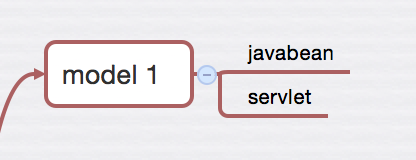
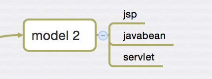
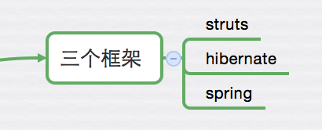
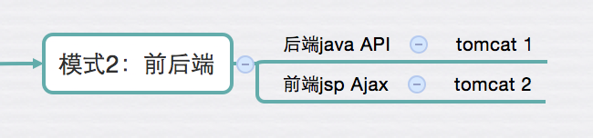
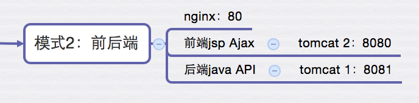
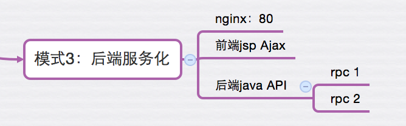
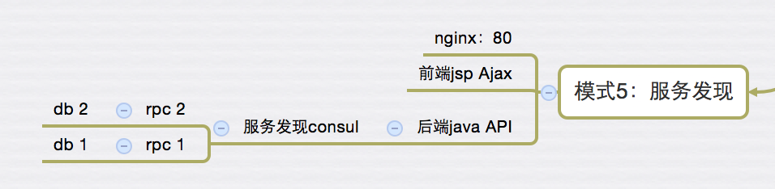
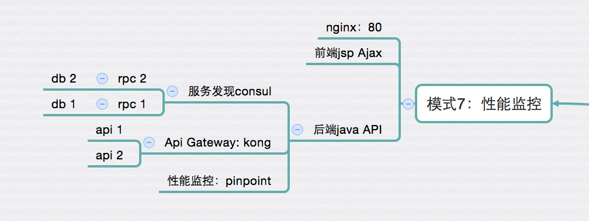
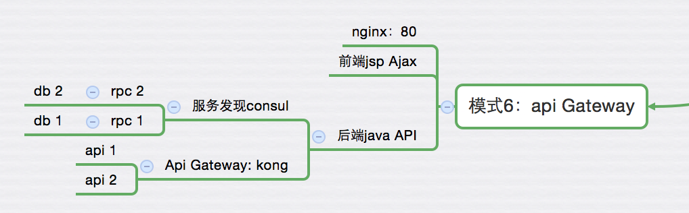
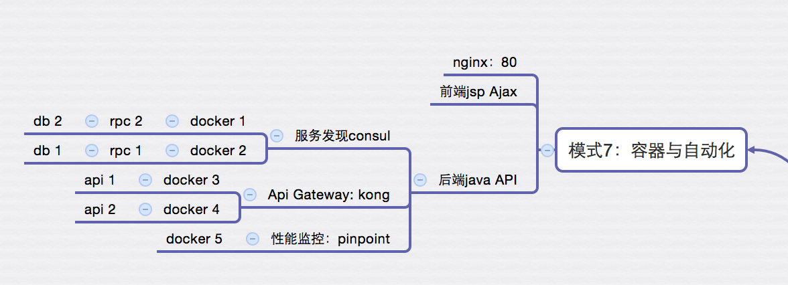

# Java项目如何与Node.js共存？

很多人都有Java背景，对于Node.js他们大多是观望，学习，可能还不是特别清楚，如果让Java项目和Node.js结合使用？

本文主要讲解的是这个问题，通过各种比较，最后给出技术栈升级的建议。


## 看一下Java的前后端定位

Java是传统的老牌后端，虽然它也可以jsp类的写点前端的东西，JavaEE里从model 1到model 2的差别就在于视图和控制器分离，引出jsp，再也不用servlet管全部了。

model 1



model 2



一般我们把WebRoot目录下面的理解为是前端，非WebRoot理解成后端。

烂大街的三大框架



这里又不是十分严格，比如后端给jsp传值，然后渲染，这时候前后端还是耦合在一起的，还不是严格意义上的前后端分离。

所以，我们彻底点，让后端只提供api，把webroot里面的api请求使用ajax替换。

app拆分成了2部分

- 后端 java api
- 前端，jsp + ajax

在彻底一点，把它们分别部署服务器上，比如tomcat

- tomcat 1（端口8080） 部署后端api
- tomcat 2（端口8081）  部署前端，jsp + ajax



这样就分开，但访问的时候可能会有跨域问题，于是我们还得把它们合并到一个域名里面，那就凑合nginx吧


```
  location / {
      proxy_redirect off;
      proxy_set_header Host $host;
      proxy_set_header X-Real-IP $remote_addr;
	    proxy_set_header X-Forwarded-For $proxy_add_x_forwarded_for;
      proxy_set_header Host $http_host;
	    proxy_set_header X-NginX-Proxy true;
	    proxy_pass http://127.0.0.1:8080;
      proxy_redirect off;
  } 
  
  # Load configuration files for the default server block.
  # include /etc/nginx/default.d/*.conf;
  # Load configuration files for the default server block.
  include /etc/nginx/default.d/*.conf;

  location /api {
      proxy_set_header X-Real-IP $remote_addr;
	    proxy_set_header X-Forwarded-For $proxy_add_x_forwarded_for;
      proxy_set_header Host $http_host;
	    proxy_set_header X-NginX-Proxy true;
	    proxy_pass http://127.0.0.1:8081;
      proxy_redirect off;
  }
```

此时访问，所有的都放到http://127.0.0.1:80端口下面，是不是就完美解决了？



## 前端优化

前端，我们还能做什么优化呢？

> 把那些js和css、图片压缩，丢到cdn上

- 研究浏览器机制，提高渲染速度
- 模块化加载
- profile
- 各种框架，angularjs，react，具体看我写的前端4阶段吧
- 各种变态预处理写法

## 后端优化

默认是使用json api风格

### API 标准写法

摘抄：http://www.startupcto.com/backend-tech/building-an-api-best-practices


You'll generally want to wrap all your API responses in an 'envelope' which specifies metadata about the APIcall.

```
// sample JSON envelope
{
  "status": {
    "code": 10000,
    "message": 'Success'
  },
  "response": {
     ...results...
  }
}
```

Doing this allows for client handler code to behave the same way for all API calls, since it gets a responses back in a universal format.

语义上再好一点，推荐：

```
// sample JSON envelope
{
  "status": {
    "code": 10000,
    "message": 'Success'
  },
  "data": {
     ...results...
  }
}
```

可视化编辑校验： http://jsoneditoronline.org/


当然restful 风格api也是非常好的。

### 使用rpc拆分服务

比较好的做法是http api调用rpc，提供最终api

- 单一调用，简单接口
- 多个调用，可以封装成上层服务，也可以组合用

rpc框架，如dubbo，dubbo-x，motan，grpc等



### rpc拆分后，拆分db

一般拆分rpc都会按照某些业务主体划分，所以数据库是可以拆分出去

比如

- 库存
- 订单
- 评论
- 弹幕

其实，只要保证用户一致，其他数据库保存各自的数据就好。在数据分析的时候，汇总到一起即可，无论etl还是stream都可以。

服务和db拆分的好处是便于横向扩展，这样就可以做到动态伸缩，哪里有瓶颈治哪里，在架构调优上是有明显优势的。

### 服务多，就要服务治理、发现

采用consul作为服务发现软件



### 服务器监控apm



这是java写的

https://github.com/naver/pinpoint

### api多了，怎么办呢？

都是重复的，如日志、权限等，这时，我们需要api Gateway。

https://getkong.org/

通过nginx + lua实现，提供插件机制，非常好用。



### 容器化，自动化运维



- docker
- saltstack

## 看一下Node.js

首先，Node.js是运行在v8之上的js 运行环境。语法上和js同出一辙，差别在于，它可以进行更多其他后端语言完成的功能，如io、网络等。

一般，大前端指的是前端 + Node.js这样的组合，这时的Node.js仅作前端工具使用。

也就是说js才是混淆点

- 前端有js
- Node也是js语法

那再俗一点

- 前端有js（Node.js作前端工具）
- 后端 Node.js (express、koa等类似于javaEE的servlet)

这样是不是就清晰多了？

好了，我们在来对比Java的部分来说

- 后端，java api
- 前端，jsp + ajax

那么，结论应该是

- jsp + ajax = Node.js + ajax
- java api = Node.js api

java接口和jsp都是跑在tomcat这样的JavaEE服务器上的，而Node.js无论是jade/ejs还是用Node.js写api接口，它们都是Node.js自身的服务器的。

这样对比的目的是为了让大家情况它们的差别。

下面我们就看一下，组合吧

- Java api 做后端
- Node.js jade/ejs + ajax 作为前端（moa-frontend就是代表）

这是比较常见，很多叫这种方位proxy，这里面设计的问题就很明显了，ajax能直接调用java api，还有复杂的业务是无法java接口直接搞定的呢？

于是各种hack，比如采用https://github.com/request/request，但是这是http请求啊，http协议还是比较重的，每次请求至少50ms，如果多几个请求，就算加上缓存也是非常难受的，那么怎么办呢？

想想我们上面说的rpc吧，在express里不调用request，换成rpc是比较靠谱的，那么问题又来了，既要支持java又要支持node，rpc框架最好是支持多语言的，这时grpc就成了比较好的选择了，不然就一言不合自己写一个？哈哈

下面来个不长见的技术栈

- jsp + ajax 作为前端
- Node.js api 做后端

这其实也是可以，只是有点多余而已，对于熟悉jsp的人未尝不是好事呢。

其实Node可以做的更多的

## Modern Web Development的四个维度


### 使用预编译

- 模板引擎
- css预处理器: less|stylus|compass|sass
- js友好语言: coffee、typescript

### 前端开发4阶段

- html/css/js（基础）
- jQuery、jQuery-ui，Extjs（曾经流行）
- Backbone（mvc），Angularjs（当前流行）
- React组件化、Vuejs（未来趋势）

Vuejs综合Angular和React的优点，应该是下一个流行趋势

### 构建工具

- grunt
- gulp
- webpack
- npm scripts

### 平台工具

跨平台覆盖，从各种浏览器到移动端、pc客户端

- 移动端 cordova
- pc客户端 electron

## 总结

讲了java和Node的定位，总结了它们的组合可能，以期读者能够明白各位能做什么，合适做什么，同时有一些比较好的实践，最后给出Node.js能做的更好的现代web开发，希望对大家有所帮助。

对于上新的技术栈，我一向是保守的，一次只上一样新的，小步快走。比如java先做前后端分离，然后再考虑把前端用node替换，然后rpc改造，甚至极端点后端也可以使用Node.js做。

